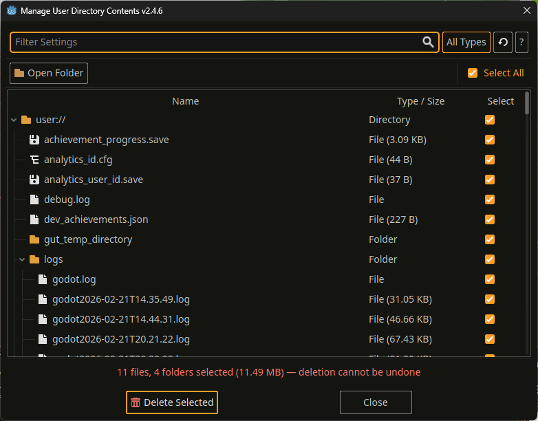
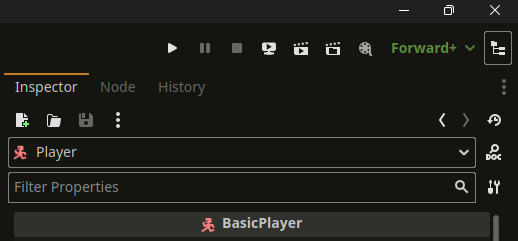
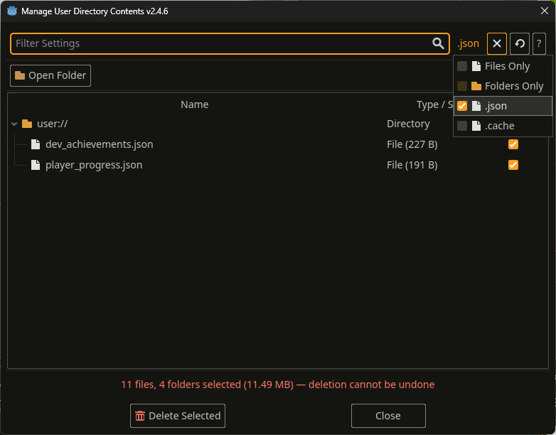
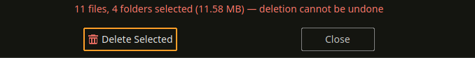
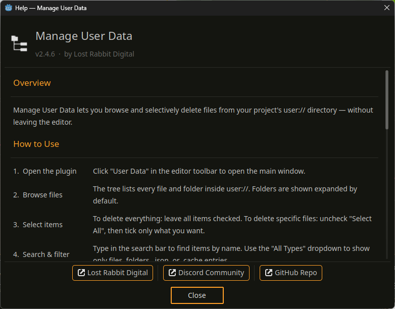

# Manage User Data


A Godot 4 editor plugin for browsing and selectively deleting your project's `user://` directory without leaving the editor.

**Requires Godot 4.1+**

[](https://godotengine.org/asset-library/asset/4811)
[](https://discord.gg/Y7caBf7gBj)



---

## Godot Asset Library

This plugin is available on the Godot Asset Library:
[https://godotengine.org/asset-library/asset/4811](https://godotengine.org/asset-library/asset/4811)

You can install it directly from within the Godot editor via the **AssetLib** tab, or download it from the link above.

---

## Install

### Asset Library (recommended)

1. Open your project → **AssetLib** → search **"Manage User Data"**
2. **Download** → **Install**
3. **Project → Project Settings → Plugins** → enable **Manage User Data**

### Manual

1. Copy `addons/manage_user_data/` into your project:
   ```
   your_project/
   └── addons/
       └── manage_user_data/
           ├── plugin.cfg
           └── plugin.gd
   ```
2. **Project → Project Settings → Plugins** → enable **Manage User Data**

---

## Usage

Click the **User Data** button in the editor toolbar to open the dialog.



| Action | How |
|---|---|
| Delete everything | Leave all items checked → **Delete Selected** |
| Delete specific files | Uncheck **Select All** → tick what you want → **Delete Selected** |
| Find a file | Type in the **Search** bar |
| Filter by type | Use the **All Types** dropdown (Files, Folders, `.json`, `.cache`) |
| Clear filters | Click **×** next to the dropdown |
| Refresh the list | Click the **⟳** icon |
| Open in file manager | Click **Open Folder** |



The status bar shows a live count and total size of selected items before you confirm. Deletion is permanent and cannot be undone.



---

## What's in user://

Godot writes to `user://` when your game uses paths like `"user://save.json"`. Common files to clean during development:

| Extension | Source |
|---|---|
| `.cfg` / `.json` | Save data |
| `.log` | Log files |
| `.cache` | Engine/game caches |

**On-disk location:**

| Platform | Path |
|---|---|
| Windows | `%APPDATA%\Godot\app_userdata\<project>\` |
| macOS | `~/Library/Application Support/Godot/app_userdata/<project>/` |
| Linux | `~/.local/share/godot/app_userdata/<project>/` |

---

## Credits



Made by [Lost Rabbit Digital](https://lostrabbit.digital/) · [Discord](https://discord.gg/Y7caBf7gBj)

MIT — see [LICENSE](LICENSE)
