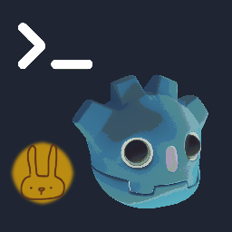

# Rabbit Developer Console



A Godot 4 in-game developer console with a Linux terminal theme. Press <kbd>~</kbd> to open it during gameplay and execute commands. Based on Jitspoe's original Developer Console addon.

**Requires Godot 4.3+**

[](https://discord.gg/Y7caBf7gBj)

---

## Features

- **Terminal-style UI** — dark background, green text, bash-like prompt
- **30+ built-in commands** — scene management, audio, performance monitoring, node inspection, and more
- **Custom commands** — register your own commands from any script
- **Autocomplete** — press <kbd>Tab</kbd> to cycle through matching commands and parameters
- **Command history** — <kbd>Up</kbd>/<kbd>Down</kbd> arrows to recall previous input, persisted across sessions
- **Font scaling** — <kbd>Ctrl</kbd>+scroll wheel to resize text on the fly
- **Fullscreen toggle** — <kbd>Ctrl</kbd>+<kbd>~</kbd> to expand the console
- **Custom themes** — set a `.tres` theme via Project Settings (`console/theme`)
- **Pause game** when console opens (optional)
- **Disable in release builds** (default)

---

## Install

### Manual

1. Copy `addons/rabbit_developer_console/` into your project:
   ```
   your_project/
   └── addons/
       └── rabbit_developer_console/
           ├── plugin.cfg
           ├── rabbit_console_plugin.gd
           ├── rabbit_console.gd
           └── builtin_commands.gd
   ```
2. **Project → Project Settings → Plugins** → enable **Developer Console**
3. The `Console` autoload singleton is added automatically

---

## Usage

Press <kbd>~</kbd> (backtick/tilde) during gameplay to open the console.

### Key Bindings

| Key | Action |
|---|---|
| <kbd>~</kbd> | Toggle console |
| <kbd>Esc</kbd> | Close console |
| <kbd>Ctrl</kbd>+<kbd>~</kbd> | Toggle fullscreen console |
| <kbd>Tab</kbd> | Autocomplete (press again to cycle) |
| <kbd>Up</kbd> / <kbd>Down</kbd> | Navigate command history |
| <kbd>PageUp</kbd> / <kbd>PageDown</kbd> | Scroll output |
| <kbd>Ctrl</kbd>+Scroll | Adjust font size |

Type `help` for a categorized list of built-in commands, or `commands_list` for all commands with usage details.

### Built-in Commands

| Category | Commands |
|---|---|
| **General** | `quit`, `exit`, `clear`, `delete_history`, `help`, `commands`, `commands_list` |
| **Output** | `echo`, `echo_warning`, `echo_info`, `echo_error` |
| **Utility** | `calc <expr>`, `exec <script>` |
| **Display** | `fullscreen`, `halfscreen`, `transparency <0-100>` |
| **Time** | `timescale <speed>` |
| **Scene** | `pause`, `unpause`, `restart`, `reload`, `load_scene <path>`, `list_scenes`, `scene_info` |
| **Inspection** | `print_tree`, `print_node <path>`, `list_autoloads`, `engine_info` |
| **Performance** | `fps`, `mem`, `vsync [mode]`, `physics_toggle` |
| **Audio** | `mute`, `unmute`, `volume <0.0-1.0>`, `volume_up`, `volume_down`, `list_buses` |

---

## Adding Custom Commands

Register commands from any script that has access to the `Console` autoload:

```gdscript
func _ready() -> void:
    Console.add_command("god", _toggle_god, 0, 0, "Toggle god mode.")
    Console.add_command("give", _give_item, ["item_id", "count"], 1, "Give an item.")
    Console.add_command_autocomplete_list("give", PackedStringArray(["sword", "shield", "potion"]))

func _toggle_god() -> void:
    player.invincible = !player.invincible
    Console.print_info("God mode: %s" % ("ON" if player.invincible else "OFF"))

func _give_item(item_id: String, count: String) -> void:
    var amount := int(count) if count.is_valid_int() else 1
    Inventory.add(item_id, amount)
    Console.print_info("Gave %d x %s" % [amount, item_id])
```

### API Reference

```gdscript
# Add a command (arguments can be an Array of names or an int for legacy support)
Console.add_command(name: String, function: Callable, arguments = [], required: int = 0, description: String = "")

# Add a hidden command (won't appear in help or autocomplete)
Console.add_hidden_command(name: String, function: Callable, arguments = [], required: int = 0)

# Remove a command (call in _exit_tree if the node may be freed)
Console.remove_command(name: String)

# Add autocomplete suggestions for a command's parameters
Console.add_command_autocomplete_list(name: String, param_list: PackedStringArray)

# Output helpers
Console.print_line(text)
Console.print_error(text)
Console.print_warning(text)
Console.print_info(text)

# Console control
Console.toggle_console()
Console.toggle_size()
Console.set_fullscreen()
Console.set_halfscreen()
Console.set_bg_transparency(value)
Console.enable()
Console.disable()
Console.is_visible()
Console.pause_enabled = true  # Pause game when console opens
Console.font_size = 18        # Set font size (-1 = default)
```

### Signals

```gdscript
Console.console_opened       # Emitted when the console is shown
Console.console_closed       # Emitted when the console is hidden
Console.console_unknown_command  # Emitted when an unrecognized command is entered
```

### Properties

```gdscript
Console.enabled: bool                   # Enable/disable the console
Console.enable_on_release_build: bool   # Allow console in release builds
Console.pause_enabled: bool             # Pause the game while console is open
Console.font_size: int                  # Override font size (-1 for default)
```

### Generating Debug Commands with AI

See [`GENERATE_DEBUG_COMMANDS.md`](GENERATE_DEBUG_COMMANDS.md) for a ready-to-use prompt that automatically scans your project and generates a complete `debug_console_commands.gd` file with project-specific commands.

---

## Custom Theme

Set a custom `.tres` theme in **Project → Project Settings → Console → Theme**.

---

## Credits

Made by [Lost Rabbit Digital](https://lostrabbit.digital/) · [Discord](https://discord.gg/Y7caBf7gBj)

MIT — see [LICENSE](LICENSE)

---

<div align="center">

## Special Thanks

<br>

### A huge thank you to [jitspoe](https://github.com/jitspoe) and the [Godot Console](https://github.com/jitspoe/godot-console) project!

This plugin was built upon and inspired by their fantastic work.
Their open-source developer console laid the foundation that made this project possible.

If you're looking for the original, check it out:

[](https://github.com/jitspoe/godot-console)

<br>

</div>
